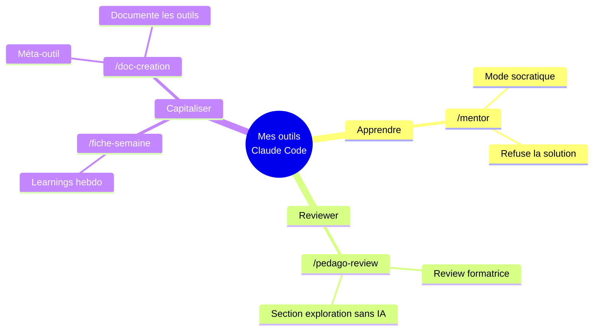
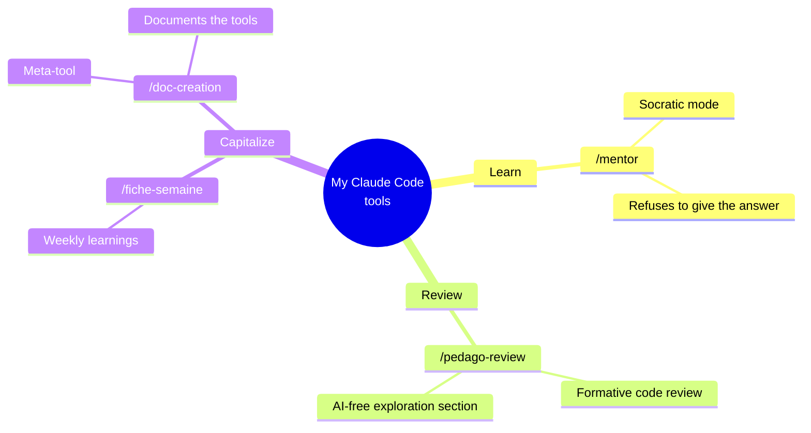

<!-- README de profil GitHub — Gwenaëlle Bussac -->

# Gwenaëlle Bussac
### Fullstack Rails Dev · Backend · Frontend · AI · CDI from July 2026

**🇫🇷 [Français](#-version-française) · 🇬🇧 [English](#-english-version)**

---

## 🇫🇷 Version française

### 👋 Hello !

Développeuse fullstack junior avec une expérience concrète en alternance, je maîtrise l'écosystème **Ruby on Rails** et contribue à des projets alliant **backend, frontend et intégration d'IA**.

Je recherche un **CDI en Île-de-France** à partir de **juillet 2026** au sein d'une équipe technique engagée.

---

### 🛠️ Stack technique

#### 🔴 Technos principales (production-ready)

#### Front-end

#### Back-end & Data

#### IA & LLM

#### Méthodes & Outils

#### En cours d'apprentissage

---

### 💼 Expériences clés

**Développeuse Web – Simundia** *(Alternance, 1 an | 07/2025 – 07/2026)*
- Développement fullstack avec **Ruby on Rails + Turbo**
- Tests d'intégration systématiques avec **RSpec**
- Intégration de solutions **IA** dans les workflows de développement
- Participation active aux **code reviews** · Mise en production

**Développeuse Informatique – microDON** *(Alternance 2 ans + CDD 6 mois | 03/2022 – 03/2024)*
- Résolution de **80% des tickets** support Jedox
- Migration Jedox → SAP Business One
- Automatisation du reporting financier · Documentation technique (15+ utilisateurs)

---

### 🚀 Projets

| Projet | Description | Stack |
|---|---|---|
| 🔦 **[Spotlight](https://github.com/IkuroMaira/spotlight)** | PWA de cartographie et filtrage de lieux par tags · déployée avec Kamal + Docker | Ruby on Rails 8 · Hotwire · PostgreSQL · Docker |
| 👗 **[Dressing Digital](https://github.com/IkuroMaira/the_virtual_closet)** | Progressive web app pour cataloguer ses vêtements | React · Python · FastAPI |
| 💍 **[Site de mariage personnalisé](https://yannessa.fr/)** | Site événementiel responsive avec optimisation des performances | HTML · CSS · JS · React |

---

### 🤖 Mes workflows IA sur mesure avec Claude Code

> Concevoir mes outils d'IA plutôt que les subir.
> Utiliser l'IA sans perdre la dimension apprentissage.

**Vue d'ensemble**

**Les 4 outils**

| Outil              | Portée  | But                                        | Ce que ça empêche                             |
| ------------------ | ------- | ------------------------------------------ | --------------------------------------------- |
| `/mentor`          | user    | Apprendre Ruby sans recevoir la solution   | Sous-traiter l'apprentissage à l'IA           |
| `/pedago-review`   | projet  | Code review rapide et formatrice           | Perdre l'aspect apprentissage en reviewant    |
| `/fiche-semaine`   | user    | Capitaliser les learnings hebdomadaires    | Oublier ce que j'ai appris la semaine passée  |
| `/doc-creation`    | user    | Documenter systématiquement mes outils IA  | Oublier le « pourquoi » 3 mois plus tard      |

**3 principes qui structurent mes outils**

- **Étape 0 de cadrage** — chaque outil commence par un alignement (objectif, plan, validation) avant l'action.
- **Décisions écartées documentées** — chaque fiche liste ce que j'ai envisagé mais pas fait, et pourquoi.
- **Section « Comment itérer »** — chaque outil a des points d'amélioration explicites à revoir après N utilisations.

---

### 🎓 Formations

- **Ada Tech School** – Développeur Web et Web Mobile RNCP 6 *(2024–2026)*
- **HETIC** – Concepteur Développeur de Solutions Digitales RNCP 6 *(2022–2023)*
- **Web Force 3** – Développeur Web RNCP 4 *(2021–2022)*
- **CESI** – Bachelor Chef de Projet Communication Digitale RNCP 6 *(2020–2021)*

---

### 📝 Reconnaissances & prises de parole

🗞️ **[« La tech m'a permis de reprendre confiance en moi »](https://www.paris.fr/pages/trois-femmes-dans-le-numerique-il-faut-casser-les-codes-31230)** — Ville de Paris, mai 2025  
Témoignage sur ma reconversion dans le numérique, dans le cadre de l'événement *Diversi'Tech* à l'Hôtel de Ville de Paris.

🎤 **[Diversi'Tech – ParisCode 10 ans](https://www.linkedin.com/posts/chlo%C3%A9-hermary-b52943a8_pariscode-diversitech-pariscode-activity-7331255850575011840-NiCO)** — Ville de Paris, mai 2025  
Invitée à représenter Ada Tech School aux côtés de sa fondatrice lors de l'événement officiel de la Ville de Paris, devant des partenaires tels que Microsoft, Google et Orange. Citée par l'Adjointe à la Maire de Paris en charge des Entreprises et du Développement Économique parmi trois femmes aux « parcours inspirants ».

🏅 **[Bourse « Women in Tech » – Dailymotion](https://www.linkedin.com/posts/ada-tech-school_womenintech-inclusion-techforgood-activity-7320344365216813056-xYsv)** — Ada Tech School, 2024  
Lauréate de la bourse de scolarité *Women in Tech* financée par Dailymotion, permettant d'intégrer Ada Tech School pour une formation de 21 mois en développement web.

---

### 📬 Me contacter

---

### 👩‍🎓 CV

---
---

## 🇬🇧 English Version

### 👋 Hello!

I'm a junior fullstack developer with solid hands-on experience in the **Ruby on Rails** ecosystem, contributing to projects spanning **backend, frontend, and AI integration**.

I'm looking for a **permanent position (CDI) in the Île-de-France region**, available from **July 2026**.

---

### 🛠️ Tech Stack

#### 🔴 Core Skills (production-ready)

#### Front-end

#### Back-end & Data

#### AI & LLM

#### Methodology & Tools

#### Currently Learning

---

### 💼 Key Experience

**Web Developer – Simundia** *(Apprenticeship, 1 year | 07/2025 – 07/2026)*
- Fullstack feature development with **Ruby on Rails + Turbo**
- Systematic integration testing with **RSpec**
- **AI solution integration** into development workflows
- Active participation in **code reviews** · Production deployment

**Software Developer – microDON** *(2-year apprenticeship + 6-month contract | 03/2022 – 03/2024)*
- Resolved **80% of support tickets** (Jedox support & administration)
- Jedox → SAP Business One migration
- Financial reporting automation · Technical documentation for 15+ users

---

### 🚀 Projects

| Project | Description | Stack |
|---|---|---|
| 🔦 **[Spotlight](https://github.com/IkuroMaira/spotlight)** | PWA that maps and filters locations by tags · deployed with Kamal + Docker | Ruby on Rails 8 · Hotwire · PostgreSQL · Docker |
| 👗 **[Digital Dressing](https://github.com/IkuroMaira/the_virtual_closet)** | Progressive web app to catalog personal clothing items | React · Python · FastAPI |
| 💍 **[Personalised Wedding Website](https://yannessa.fr/)** | Responsive event website with performance optimization | HTML · CSS · JS · React |

---

### 🤖 My custom AI workflows with Claude Code

> Designing my own AI tools rather than just consuming them.
> Using AI without losing the learning dimension.

**Overview**

**The 4 tools**

| Tool               | Scope   | Purpose                                    | What it prevents                              |
| ------------------ | ------- | ------------------------------------------ | --------------------------------------------- |
| `/mentor`          | user    | Learn Ruby without being handed the answer | Outsourcing my learning to AI                 |
| `/pedago-review`   | project | Fast, formative code reviews               | Losing the learning dimension while reviewing |
| `/fiche-semaine`   | user    | Capture weekly learnings                   | Forgetting what I learned last week           |
| `/doc-creation`    | user    | Systematically document my AI tools        | Forgetting the *why* 3 months later           |

**3 principles shaping my tools**

- **Step 0 — framing** — each tool starts with an alignment phase (goal, plan, validation) before any action.
- **Discarded alternatives documented** — each note lists what I considered but didn't do, and why.
- **"How to iterate" section** — each tool has explicit improvement points to revisit after N uses.

---

### 🎓 Education

- **Ada Tech School** – Web & Mobile Developer RNCP 6 *(2024–2026)*
- **HETIC** – Digital Solutions Developer RNCP 6 *(2022–2023)*
- **Web Force 3** – Web Developer RNCP 4 *(2021–2022)*
- **CESI** – Bachelor in Digital Project Management RNCP 6 *(2020–2021)*

---

### 📝 Recognitions & Press
 
🗞️ **[« La tech m'a permis de reprendre confiance en moi »](https://www.paris.fr/pages/trois-femmes-dans-le-numerique-il-faut-casser-les-codes-31230)** — Ville de Paris, May 2025  
Featured in *Diversi'Tech*, a Ville de Paris event celebrating women in tech, sharing my journey into software development. *(Article in French)*
 
🎤 **[Diversi'Tech – ParisCode 10th Anniversary](https://www.linkedin.com/posts/chlo%C3%A9-hermary-b52943a8_pariscode-diversitech-pariscode-activity-7331255850575011840-NiCO)** — Ville de Paris, May 2025  
Invited to represent Ada Tech School alongside its founder at an official Ville de Paris event, in front of partners including Microsoft, Google, and Orange. Named by the Deputy Mayor of Paris for Economic Development among three women with "inspiring career paths". *(Post in French)*

🏅 **[Women in Tech Scholarship – Dailymotion](https://www.linkedin.com/posts/ada-tech-school_womenintech-inclusion-techforgood-activity-7320344365216813056-xYsv)** — Ada Tech School, 2024  
Selected as the recipient of Dailymotion's *Women in Tech* scholarship to join Ada Tech School's 21-month web development programme. *(Post in French)*

---

### 📬 Get in touch

---

### 👩‍🎓 CV

